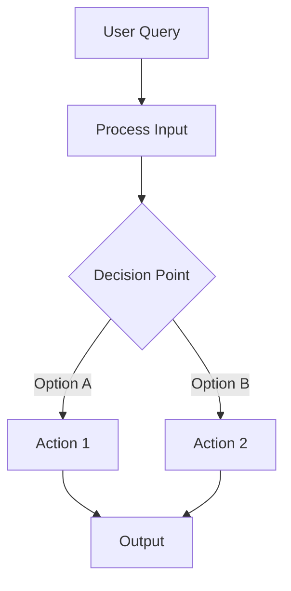
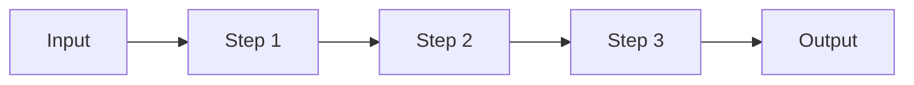
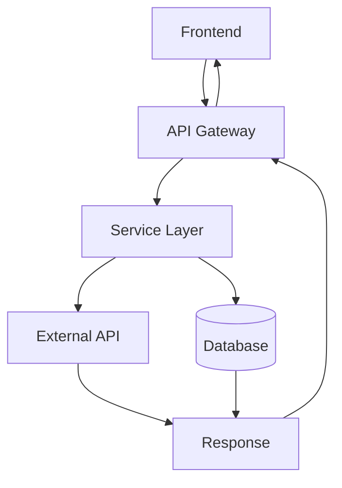

# Mermaid Diagram Guide

Use Mermaid diagrams to visualize architecture flows, system interactions, and decision trees in PR descriptions.

## When to Include a Diagram

Include a Mermaid diagram when the PR introduces:

- A new multi-step flow (e.g., message processing pipeline)
- Branching logic or decision trees (e.g., agent choosing between tools)
- Component interactions across system boundaries (e.g., frontend → API → DB)
- Event-driven architectures (e.g., command → event → reaction)

Do NOT include a diagram for:

- Simple CRUD changes
- Style/formatting-only changes
- Single-file refactors
- Documentation updates

## Preferred Patterns

### Top-Down Flow (most common for PR descriptions)



### Left-to-Right Flow (for sequential pipelines)



### Component Interaction



## Style Rules

1. **Node labels**: Use descriptive names — `[Load Conversation History]` not `[Load]`
2. **Highlight key nodes** with `style` directives for critical/new components:
   ```
   style NodeName fill:#808080,stroke:#333,stroke-width:2px
   ```
3. **Max depth**: Keep to ≤ 12 nodes for readability
4. **Arrow types**:
   - `-->` solid (normal flow)
   - `-.->` dashed (optional/async)
   - `==>` thick (critical path)
5. **Decision nodes**: Use `{Curly braces}` for diamond shapes
6. **Database nodes**: Use `[(Brackets with parens)]` for cylinder shapes
7. **Colors**: Use neutral grays (`#707070`, `#808080`, `#909090`) for highlighted nodes — avoid bright colors that clash with GitHub's dark/light themes

## Naming the Section

Name the section based on what the diagram represents:

- "Chatbot Message Flow"
- "Authentication Pipeline"
- "Property Ingestion Flow"
- "Booking Wizard State Machine"

Format: `## {{ System Name }} Flow`
