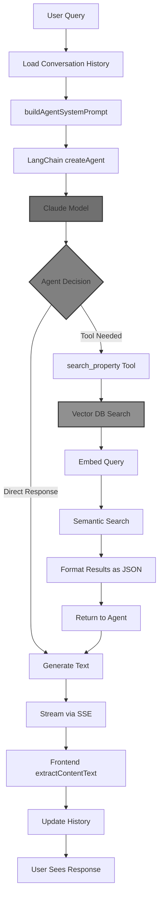

# Example: Feature PR with Demo Video and Mermaid Diagram

Style: Concise | Sections: Demo Video, What's New, Architecture Flow, Local Setup, Testing

---

## Demo Video

Watch this video for a demonstration of the LangChain agent-based chatbot with property search capabilities:

https://github.com/user-attachments/assets/0a76752f-fe34-486c-b7ec-c9b2444a3ade

## What's New

**LangChain Agent Architecture**

- LangChain integration with `createAgent` for autonomous agent execution
- Claude Haiku 4.5 model (fast, cost-optimized) with configurable temperature (0.3) and max tokens (64k)
- Future-based error handling via LangChain service wrapper
- Agent streaming with `streamMode: "messages"` for real-time token delivery

**Streaming Infrastructure**

- SSE (Server-Sent Events) adapter for LangChain agent message streams
- Stream event types: `token` (with content + node metadata), `error`
- Router-level SSE support with `sse()` helper for Express response handling
- Frontend `StreamRequest` class with `stream()` function for SSE consumption
- Real-time content extraction via `extractContentText()` utility

**Property Search Tool**

- `search_property` tool for vector database semantic search
- Dynamic limit selection (1-25 properties) based on user intent
- Natural language query embedding via transformer service
- Structured JSON payload output with property details
- Error handling with user-friendly error messages

## Chatbot Message Flow

## Additional for Run Locally

**Qdrant Vector Database**

- Running locally at (`./utils.sh backend up`): `http://localhost:6333/`
- Test data snapshot: [Link](https://drive.google.com/file/d/1HFQCbslo0sbq2FUJ0cOK6a1ewb5GuOZa/view?usp=sharing)
- Obs: the name of the collection must be `Property_Embeddings` because currently this is hardcoded.

## Testing & Feedback

We encourage everyone to test the chatbot interactions and provide feedback. If you find any bugs or have recommendations for improvements, please open an issue and assign it to me.
