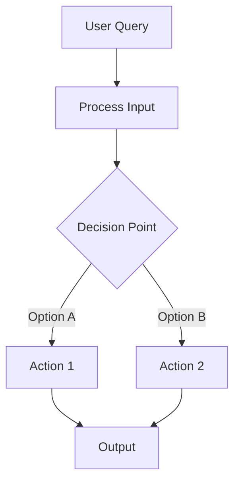

# Mermaid Diagrams

A diagram earns its place on a multi-step flow, branching logic, a
cross-boundary interaction, or an event chain — not on CRUD, formatting,
single-file refactors, or docs. That judgement decides whether `pr-body` offers
the Architecture Flow option, not whether the section renders once chosen.



## Style

- Use `graph TD`. Descriptive node labels — `[Load Conversation History]`, not `[Load]`.
- Highlight new or critical nodes:
  ```
  style NodeName fill:#808080,stroke:#333,stroke-width:2px
  ```
- Keep to 12 nodes or fewer.
- Arrows: `-->` normal flow, `-.->` optional or async, `==>` critical path.
- `{Curly braces}` for decision diamonds, `[(Brackets with parens)]` for databases.
- Neutral grays only (`#707070`, `#808080`, `#909090`) — bright colors clash with
  GitHub's dark and light themes.

Name the section `## {{ System Name }} Flow` — "Authentication Pipeline Flow".
