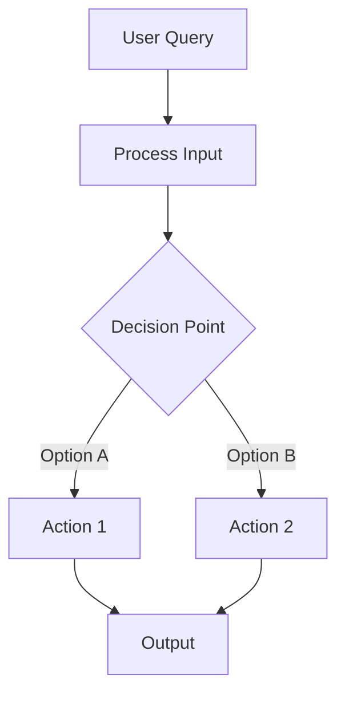

# Mermaid Diagrams

A diagram earns its place on a multi-step flow, branching logic, a
cross-boundary interaction, or an event chain — not on CRUD, formatting,
single-file refactors, or docs. That judgement decides whether `pr-body` offers
the Architecture Flow option, not whether the section renders once chosen.

## Style

- Prefer `flowchart TB` for actors and branching; `flowchart LR` for simple pipelines.
- Quote node labels — `A["Load Conversation History"]`, not `A[Load]`.
- No custom `style` fills or colors.
- Keep to 15 nodes or fewer.
- Arrows: `-->` normal flow, `-.->` optional or async, `==>` critical path.
- `{Curly braces}` for decision diamonds, `[(Brackets with parens)]` for databases.

Name the section `## {{ System Name }} Flow` — "Authentication Pipeline Flow".
